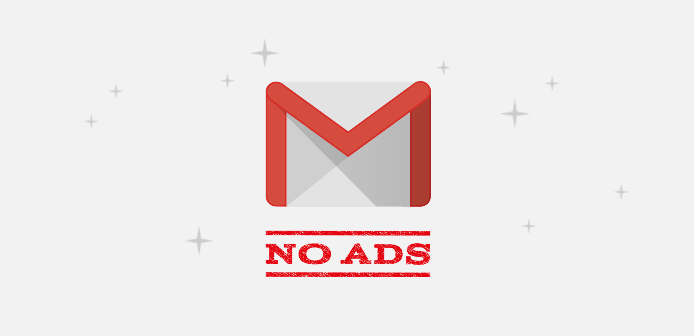

# Gmail No Ads

[](http://makeapullrequest.com)
[](https://www.gnu.org/licenses/gpl-3.0)

Free & Open Source Tweak for Gmail app on iOS!



## Features
- Remove Ads
- Lightweight
- Support iOS 10 (not tested) - 11 (tested) - 12 (tested) - 13 (tested)
- Support latest Gmail version (If it doesn't work, you should update the app to latest version)

## Cydia Repo

[https://magiczzz07.github.io/ios](https://magiczzz07.github.io/ios)

<!-- ## Screenshot

 -->

## Building

[Theos](https://github.com/theos/theos) required.

```bash
make do
```

## Contributors

[haoict](https://github.com/haoict)
[magicZ](https://magiczzz07.github.io/ios)

Contributions of any kind welcome!

## License

Licensed under the [GPLv3 License](./LICENSE), Copyright © 2020